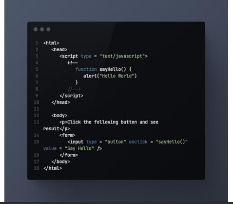

# DOM
The backbone of an HTML 
document is tags.
According to the Document Object
Model (DOM), every HTML tag is an
object. Nested tags are “children” of
the enclosing one. The text inside a 
tag is an object as well
# DOM - Searching: getElement*, 
# querySelector* - getElementById
If an element has the id
attribute, we can get the
element using the method
document.getElementById(i
d), no matter where it is.
For instance
# DOM - Searching: Styles and classes
Before we get into JavaScript’s ways of dealing with styles and classes –
here’s an important rule. Hopefully it’s obvious enough, but we still have to 
mention it.
There are generally two ways to style an element:
Create a class in CSS and add it: 

Write properties directly into style: 
.
JavaScript can modify both classes and style properties.
We should always prefer CSS classes to style. The latter should only be 
used if classes "can't handle it".
For example, style is acceptable if we calculate coordinates of an element 
dynamically and want to set them from JavaScript, like this:
# DOM - Searching: Styles and classes
Changing a class is one of the most frequently used actions in scripts.
In the ancient time, there was a limitation in JavaScript: a reserved word like "class" 
could not be an object property. That limitation does not exist now, but at that time it
was impossible to have a "class" property, like elem.class.
So for classes the similar-looking property "className" was introduced: the
elem.className corresponds to the "class" attribute.
For instance

If we assign something to elem.className, it replaces the whole string of classes. 
Sometimes that's what we need, but often we want to add/remove a single class.
There's another property for that: elem.classList.
The elem.classList is a special object with methods to add/remove/toggle a single 
class.
For instance:
# Introduction to browser events
JavaScript's interaction with HTML is 
handled through events that occur 
when the user or the browser 
manipulates a page.
When the page loads, it is called an 
event. When the user clicks a button, 
that click too is an event. Other 
examples include events like 
pressing any key, closing a window, 
resizing a window, etc.

# Forms, controls
The change event triggers when the element has finished changing.
For text inputs that means that the event occurs when it loses focus.
For instance, while we are typing in the text field below – there's no event. But when we
move the focus somewhere else, for instance, click on a button – there will be a change
event